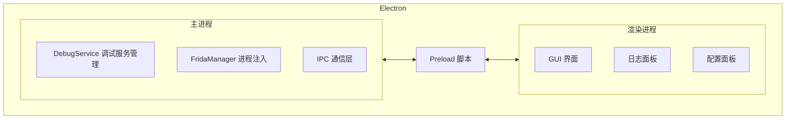

### electron-gui ###
将 WMPFDebugger 项目从命令行工具改造为 Electron 桌面应用，提供现代风格的 GUI 界面，包含一键启停调试服务、实时日志面板、端口配置、WMPF 版本检测、进程列表和一键打开 DevTools 等功能。


# 将 WMPFDebugger 改造为 Electron GUI 桌面应用

## 背景

当前 WMPFDebugger 是一个纯命令行工具，通过 `npx ts-node src/index.ts` 启动。用户希望将其改造为 Electron 桌面应用，提供现代风格的 GUI 界面，包含完整的调试服务管理功能。

## 设计方案

### 架构设计

采用 Electron 主进程 + 渲染进程架构：

- **主进程（Main Process）**：负责调试服务的核心逻辑（Debug Server、Proxy Server、Frida 注入），通过 IPC 与渲染进程通信
- **渲染进程（Renderer Process）**：纯 HTML/CSS/JS 实现的 GUI 界面，无需额外前端框架，保持轻量
- **Preload 脚本**：安全地暴露主进程 API 给渲染进程



### 目录结构

```
WMPFDebugger/
├── electron/
│   ├── main.ts              # Electron 主进程入口
│   ├── preload.ts           # Preload 脚本，暴露安全 API
│   └── debugService.ts      # 调试服务核心逻辑（从 src/index.ts 重构）
├── renderer/
│   ├── index.html           # GUI 主页面
│   ├── styles.css           # 现代风格样式
│   └── renderer.js          # 渲染进程逻辑
├── src/
│   ├── index.ts             # 保留原有 CLI 入口（不修改）
│   └── third-party/         # 保持不变
├── frida/                   # 保持不变
├── package.json             # 添加 Electron 依赖和脚本
└── tsconfig.electron.json   # Electron 专用 TS 配置
```

> [!IMPORTANT]
> 原有的 `src/index.ts` CLI 入口将保持不变，GUI 版本是独立的新入口，两种方式可以共存。

---

### 核心组件

#### Electron 主进程

##### [NEW] [main.ts](file:///C:/Users/lql/Desktop/WMPFDebugger/electron/main.ts)

Electron 应用入口，负责：
- 创建 BrowserWindow（1000x700，现代无边框风格）
- 注册所有 IPC 事件处理器
- 管理应用生命周期

##### [NEW] [preload.ts](file:///C:/Users/lql/Desktop/WMPFDebugger/electron/preload.ts)

通过 `contextBridge` 安全暴露以下 API：
- `debugger.start(config)` - 启动调试服务
- `debugger.stop()` - 停止调试服务
- `debugger.getProcesses()` - 获取 WeChatAppEx 进程列表
- `debugger.getVersions()` - 获取支持的 WMPF 版本列表
- `debugger.openDevTools(port)` - 打开 DevTools 链接
- `debugger.onLog(callback)` - 监听日志事件
- `debugger.onStatusChange(callback)` - 监听状态变化

##### [NEW] [debugService.ts](file:///C:/Users/lql/Desktop/WMPFDebugger/electron/debugService.ts)

从 `src/index.ts` 重构核心逻辑为可控的服务类：

```typescript
class DebugService extends EventEmitter {
    private debugWss: WebSocketServer | null = null;
    private proxyWss: WebSocketServer | null = null;
    private fridaSession: frida.Session | null = null;
    private running: boolean = false;

    async start(config: { debugPort: number; cdpPort: number }): Promise<void>;
    async stop(): Promise<void>;
    async getProcesses(): Promise<ProcessInfo[]>;
    async getAvailableVersions(): Promise<number[]>;
    isRunning(): boolean;
}
```

关键改进：
- 所有 `console.log` 替换为事件发射（`this.emit('log', ...)`），日志可被 GUI 捕获
- 支持优雅停止（关闭 WebSocket 服务器、detach Frida session）
- 错误不再直接 throw，而是通过事件通知 GUI

---

#### 渲染进程 GUI

##### [NEW] [index.html](file:///C:/Users/lql/Desktop/WMPFDebugger/renderer/index.html)

现代风格的单页面应用，包含以下区域：
- **顶部标题栏**：应用名称 + 自定义窗口控制按钮（最小化/最大化/关闭）
- **状态指示区**：服务运行状态（圆形指示灯 + 文字）
- **控制面板**：启动/停止按钮、端口配置输入框
- **信息面板**：WMPF 版本显示、进程列表表格
- **日志面板**：实时滚动日志区域，支持不同级别的颜色区分
- **底部操作栏**：一键打开 DevTools 按钮、刷新进程列表按钮

##### [NEW] [styles.css](file:///C:/Users/lql/Desktop/WMPFDebugger/renderer/styles.css)

现代风格 CSS 设计：
- 配色方案：深色背景（#1e1e2e）+ 蓝紫色调主题色（#7c3aed）
- 卡片式布局，圆角 + 微妙阴影
- 状态指示器带脉冲动画（运行中时绿色脉冲）
- 按钮 hover/active 过渡动画
- 日志面板等宽字体，不同日志级别不同颜色（info=白色, error=红色, warn=黄色, success=绿色）
- 响应式布局适配窗口大小变化

##### [NEW] [renderer.js](file:///C:/Users/lql/Desktop/WMPFDebugger/renderer/renderer.js)

渲染进程逻辑：
- 通过 preload 暴露的 API 与主进程通信
- 管理 UI 状态（服务状态、日志列表、进程列表）
- 日志自动滚动到底部，最多保留 1000 条
- 端口输入验证（1024-65535 范围）
- 启动/停止按钮状态联动

---

#### 配置文件

##### [MODIFY] [package.json](file:///C:/Users/lql/Desktop/WMPFDebugger/package.json)

添加 Electron 相关依赖和脚本：

```diff
{
  "name": "WMPFDebugger",
  "version": "1.0.0",
- "main": "src/index.ts",
+ "main": "dist-electron/main.js",
  "license": "GPL-2.0-only",
  "author": "evi0s",
+ "scripts": {
+   "cli": "npx ts-node src/index.ts",
+   "build:electron": "tsc -p tsconfig.electron.json",
+   "start": "yarn build:electron && electron .",
+   "dev": "yarn build:electron && electron ."
+ },
  "dependencies": {
    "frida": "^17.3.2",
    "protobufjs": "^7.5.4",
    "ws": "^8.18.3"
  },
  "devDependencies": {
    "@types/node": "^24.5.2",
    "@types/ws": "^8.18.1",
+   "electron": "^33.0.0",
    "ts-node": "^10.9.2",
    "typescript": "^5.9.2"
  }
}
```

##### [NEW] [tsconfig.electron.json](file:///C:/Users/lql/Desktop/WMPFDebugger/tsconfig.electron.json)

Electron 专用 TypeScript 编译配置：
- 输出目录：`dist-electron/`
- 包含：`electron/` 目录下的 `.ts` 文件
- 排除：`node_modules`、`src/third-party`

##### [MODIFY] [.gitignore](file:///C:/Users/lql/Desktop/WMPFDebugger/.gitignore)

添加 `dist-electron/` 到忽略列表。

---

## Verification Plan

### Automated Tests

```bash
# 1. 编译 Electron TypeScript 文件
yarn build:electron

# 2. 启动 Electron 应用
yarn start
```

### Manual Verification

- 验证 GUI 界面正常显示，布局和样式符合现代风格
- 验证端口配置输入框可以正常修改端口号
- 验证"刷新进程"按钮可以检测到 WeChatAppEx 进程（需要微信运行中）
- 验证启动/停止按钮可以正常控制调试服务
- 验证日志面板实时显示服务日志
- 验证"打开 DevTools"按钮可以在默认浏览器中打开调试链接
- 验证原有 CLI 模式仍然可用：`npx ts-node src/index.ts`


updateAtTime: 2026/3/13 11:10:55

planId: b2d1b65e-deae-4049-9d96-7ef9ebfb8af5